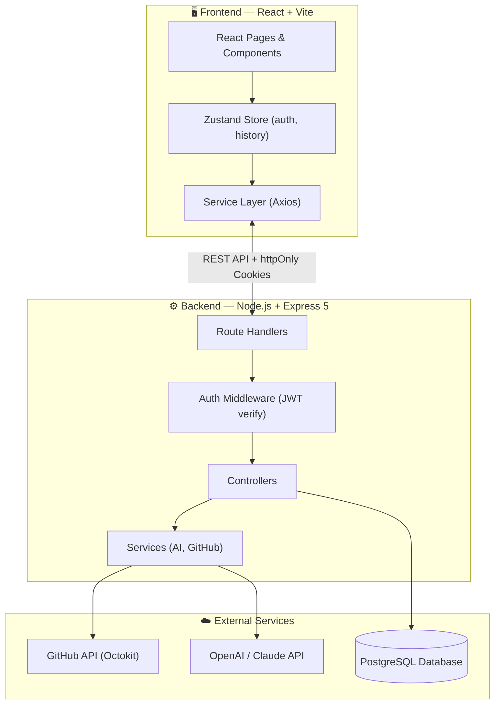

<p align="center">
  
</p>

<h1 align="center">🔍 PRLens</h1>
<p align="center">
  <strong>AI-powered Pull Request analysis tool — review PRs faster with intelligent insights</strong>
</p>

<p align="center">
  <a href="#-features">✨ Features</a> &nbsp;·&nbsp;
  <a href="#-quick-start">🚀 Quick Start</a> &nbsp;·&nbsp;
  <a href="#-documentation">📚 Documentation</a>
</p>

<p align="center">
  
  
  
  
  
  
  
  
</p>

---

## 🔗 Demo
[Add Demo Link Here]

## ✨ Key Features

### Core Analysis
| Feature | Description |
|---------|-------------|
| 📊 **PR Summary** | AI-generated overview of what the PR does, its size, and impact |
| 📂 **File Changes** | Structured view of added/modified/deleted files with stats |
| 🚨 **Risk Detection** | Highlights breaking changes, security concerns, and anti-patterns |
| 💬 **AI Chat** | Context-aware chat powered by LLMs — ask follow-up questions about the PR |

### User Experience
| Feature | Description |
|---------|-------------|
| 🔐 **GitHub OAuth** | Secure login with GitHub to access private and public repositories |
| 📜 **Analysis History** | Revisit previously analyzed PRs from your personal history |
| 📱 **Responsive UI** | Clean, modern dashboard with native-like mobile scroll handling |
| ⚡ **Fast Analysis** | Caching and optimized GitHub API calls for quick results |
| 📡 **Real-time Progress** | Live UI updates during PR analysis via Server-Sent Events (SSE) |

## 📸 Screenshots

*(Add screenshots here)*

## 🛠 Tech Stack

**Frontend:** React 19, Vite 7, Tailwind CSS 4, Zustand 5, Axios, React Router DOM 7  
**Backend:** Node.js 18+, Express 5, PostgreSQL, pgvector, LangChain, OpenAI SDK, Octokit  
**AI Providers:** OpenRouter, Modal AI, NVIDIA, Gemini  

## 🏗 High-Level Architecture



## 🚀 Quick Start

### Prerequisites
- **Node.js** v18+ and **npm**
- **PostgreSQL** (local install or Neon/Supabase)
- **GitHub OAuth App**
- **AI API Key** (OpenAI, Anthropic, or OpenRouter)

### Installation
```bash
git clone https://github.com/Makwana-Nikunj/PRLens.git
cd PRLens

# Install backend dependencies
cd Backend && npm install

# Install frontend dependencies
cd ../frontend && npm install
```

### Minimal Environment Setup
Create `Backend/.env` and `frontend/.env` files based on the `.env.example` files provided in their respective directories. See [Environment Variables](docs/environment.md) for detailed configuration.

### Run Development Servers
```bash
# Backend (Terminal 1)
cd Backend && npm run dev

# Frontend (Terminal 2)
cd frontend && npm run dev
```
Open **http://localhost:5173** and login with GitHub.

## 📁 Simplified Project Structure

```
PRLens/
├── docs/                 # Detailed documentation
├── Backend/              # Node.js + Express + PostgreSQL
│   └── src/
│       ├── controllers/  # API route logic
│       ├── services/     # AI, GitHub, RAG logic
│       ├── middlewares/  # Auth, rate limiting
│       └── db/           # PostgreSQL connection
└── frontend/             # React + Vite
    └── src/
        ├── Components/   # Reusable UI parts
        ├── pages/        # Route pages
        ├── store/        # Zustand state
        └── services/     # API clients & SSE
```

## ⚡ Engineering Challenges Solved

### Multi-Provider AI Orchestration
Built round-robin provider selection with automatic retries and failover.

### Scalable RAG Pipeline
Implemented pgvector + HNSW indexing using 1536-dimensional Gemini embeddings.

### Real-Time Streaming
Implemented Server-Sent Events for live PR analysis and chat responses.

### Secure Authentication
Implemented GitHub OAuth with PKCE, JWT, refresh tokens, and httpOnly cookies.

### Performance Optimization
Added caching, compression, connection pooling, and lazy loading.

## 🗺 Roadmap
- [ ] Add support for GitLab and Bitbucket.
- [ ] Implement team workspaces.
- [ ] Add more granular RAG controls.

## 🤝 Contributing
Contributions are welcome! Please open an issue or submit a pull request.

## 👨‍💻 Author
**Nikunj Malwana**
- GitHub: [@Makwana-Nikunj](https://github.com/Makwana-Nikunj)
- LinkedIn: [Nikunj Malwana](https://www.linkedin.com/in/makwana-nikunj-gec-ldce-it-dte/)

## 📄 License
This project is licensed under the **ISC License**.

---

## 📚 Documentation

Detailed documentation has been moved to the `docs/` directory:

* [Architecture](docs/architecture.md)
* [RAG Architecture](docs/rag-architecture.md)
* [API Reference](docs/api-reference.md)
* [Frontend Guide](docs/frontend.md)
* [Deployment Guide](docs/deployment.md)
* [Environment Variables](docs/environment.md)
* [Troubleshooting](docs/troubleshooting.md)
