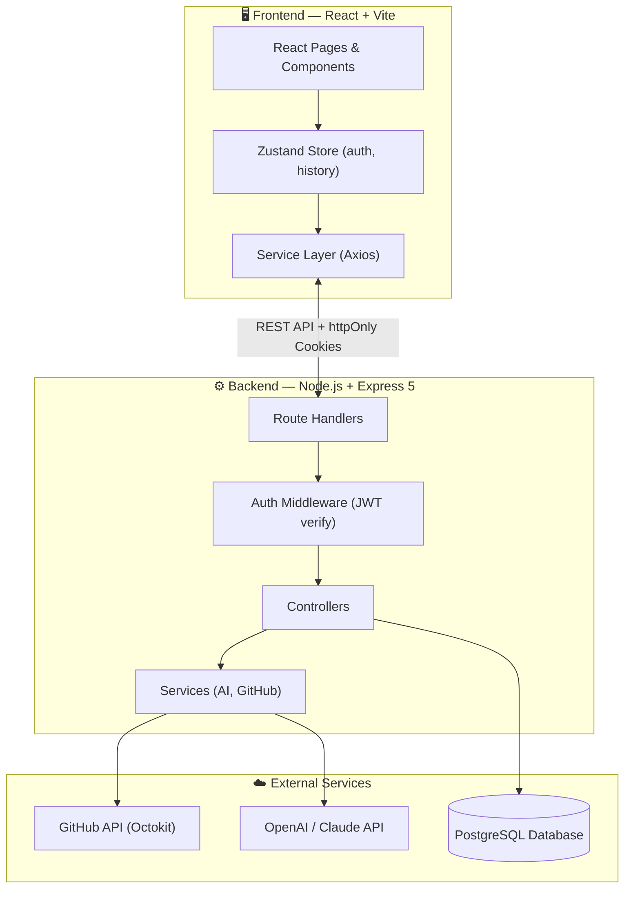
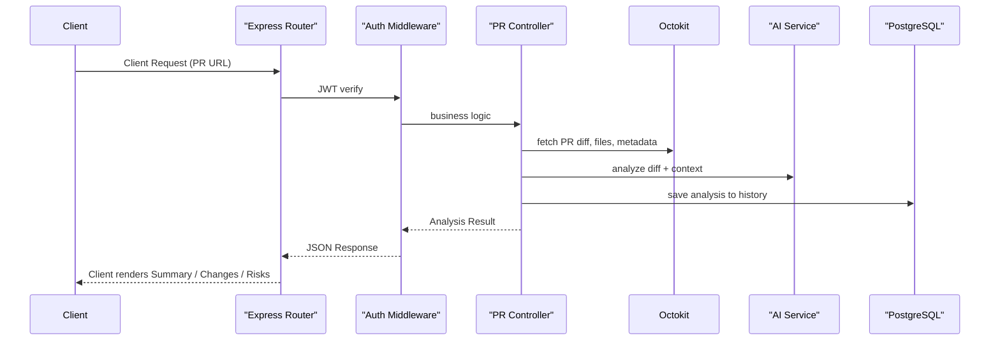

# System Architecture

```mermaid
flowchart TB
    subgraph Client["🖥 Frontend — React + Vite"]
        UI["React Pages & Components"]
        Store["Zustand Store (auth, history)"]
        Services["Service Layer (Axios)"]
        UI --> Store --> Services
    end

    subgraph Server["⚙️ Backend — Node.js + Express 5"]
        Routes["Route Handlers"]
        Auth["Auth Middleware (JWT verify)"]
        Controllers["Controllers"]
        Services2["Services (AI, GitHub)"]
        Routes --> Auth --> Controllers --> Services2
    end

    subgraph External["☁️ External Services"]
        GitHub["GitHub API (Octokit)"]
        AI["OpenAI / Claude API"]
        PostgreSQL[("PostgreSQL Database")]
    end

    Services <-->|"REST API + httpOnly Cookies"| Routes
    Services2 --> GitHub
    Services2 --> AI
    Controllers --> PostgreSQL
```

### Request Flow

```mermaid
sequenceDiagram
    participant Client
    participant Router as "Express Router"
    participant Auth as "Auth Middleware"
    participant Controller as "PR Controller"
    participant Octokit
    participant AI as "AI Service"
    participant DB as "PostgreSQL"
    
    Client->>Router: Client Request (PR URL)
    Router->>Auth: JWT verify
    Auth->>Controller: business logic
    
    Controller->>Octokit: fetch PR diff, files, metadata
    Controller->>AI: analyze diff + context
    Controller->>DB: save analysis to history
    
    Controller-->>Auth: Analysis Result
    Auth-->>Router: JSON Response
    Router-->>Client: Client renders Summary / Changes / Risks
```