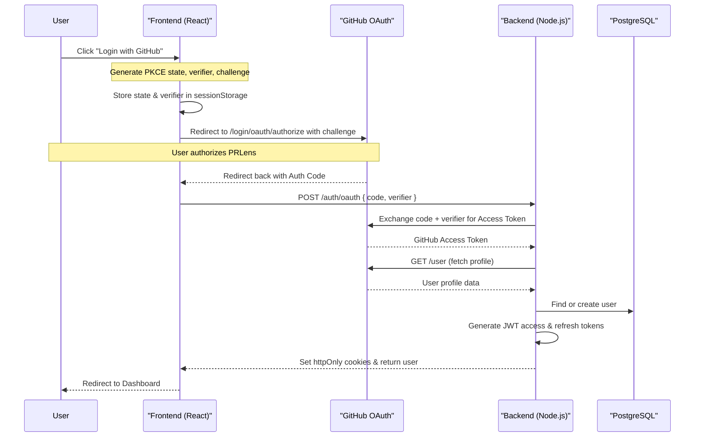
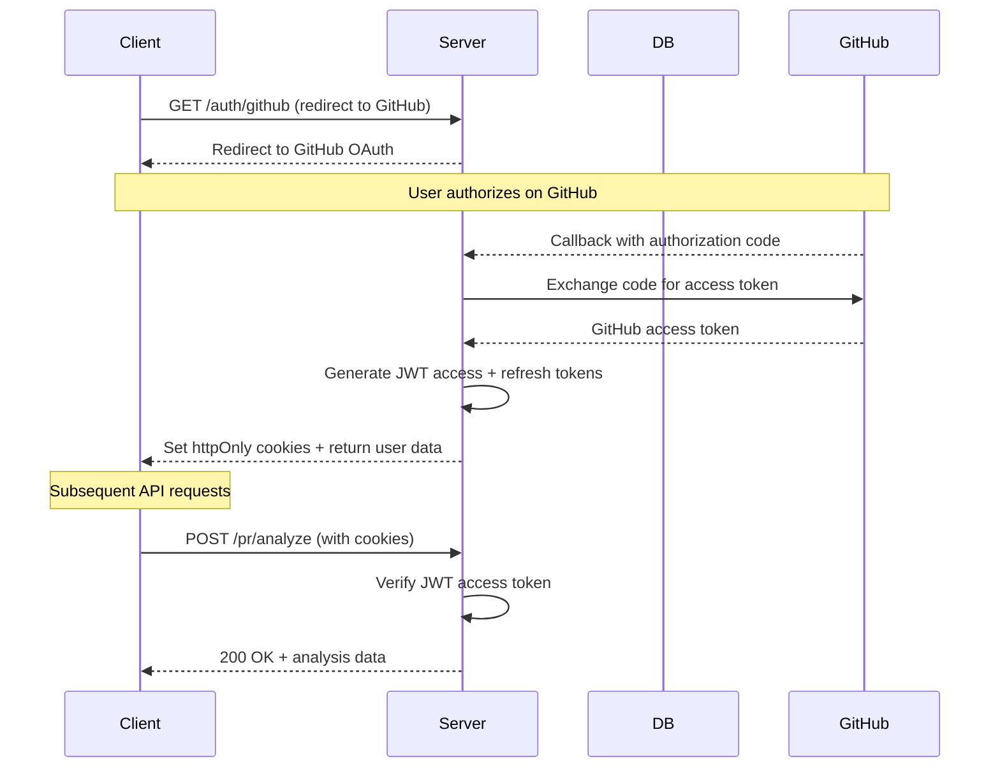

# Frontend Documentation

### Routing

| Route | Page | Access | Description |
|-------|------|--------|-------------|
| `/` | LandingPage | Public | Landing page with PR input and marketing sections |
| `/login` | GithubSignIn | Public | PKCE-based GitHub OAuth trigger |
| `/dashboard` | Dashboard | 🔒 Auth | PR analysis dashboard with sidebar + chat |
| `/dashboard/:id` | FileExplanations | 🔒 Auth | Per-PR file explanations detail |
| `/chat/:id` | ChatInterface | 🔒 Auth | Standalone chat interface |
| `/docs` | DocsPage | Public | Documentation hub |
| `/docs/getting-started` | GettingStartedPage | Public | Setup guide |
| `/docs/features` | FeaturesPage | Public | Feature overview |
| `/docs/faq` | FAQPage | Public | Frequently asked questions |
| `/ai-code-review` | AIReviewPage | Public | AI review info page |
| `/github-pull-request-analysis` | GitHubPRAnalysisPage | Public | Product info page |
| `/pull-request-summary` | PRSummaryPage | Public | Product info page |
| `/code-review-automation` | CodeReviewAutomationPage | Public | Product info page |
| `/blog` | BlogPage | Public | Blog hub |
| `/blog/...` | 10 blog posts | Public | SEO content pages |

### Dashboard Tabs

| Tab | Component | Description |
|-----|-----------|-------------|
| **Summary** | `TabSummary` | AI-generated PR overview, description, and impact |
| **Key Changes** | `TabChanges` | File-level diff stats, additions/deletions |
| **Risks** | `TabRisks` | Detected risks, severity levels, recommendations |
| **Reviewer Checklist** | `TabChecklist` | Actionable review checklist |
| **File Explanations** | `TabFileExplanations` | Per-file AI explanations |

### State Management

| Zustand Store | Purpose | Key Actions | Persistence |
|---------------|---------|-------------|-------------|
| `authStore` | User auth state | `login`, `logout`, `getCurrentUser` | localStorage (`auth-storage`) |

> `prStore` and `chatStore` have been replaced with local component state + `useChat` hook in `frontend/src/hooks/useChat.js`.

### OAuth Flow (PKCE)

The frontend uses **PKCE** (Proof Key for Code Exchange) via the Web Crypto API to securely authenticate users:

### Streaming & SSE

Both AI Chat (`chatService.sendMessage`) and PR Analysis (`prService.analyzePr`) use the **Fetch API + ReadableStream** directly (instead of Axios) because Server-Sent Events (SSE) require unbuffered streaming. The custom stream parsers handle:
- Real-time progress and phase updates during PR analysis
- Emitting text chunks to `onChunk` callbacks for AI chat
- AbortController for immediate cancellation
- Line-buffered SSE parsing (`data: ...` frames)
- Server-side persistence of both user and assistant messages

### API Client

`apiClient` (Axios instance) handles:
- **401 interceptors** with queued refresh requests (prevents request storms)
- Auto-redirect to `/login` on failed refresh
- 5-minute timeout for PR analysis
- Credentials included for cookie-based auth

## Authentication Flows

### JWT Token Flow

