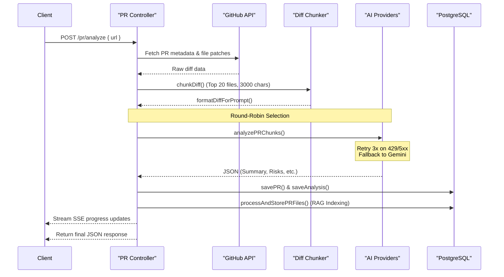
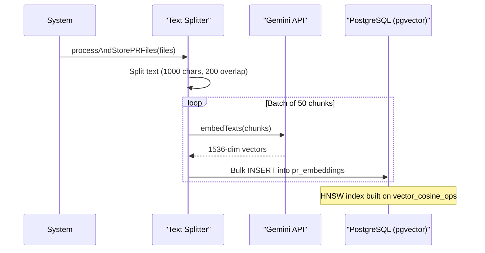
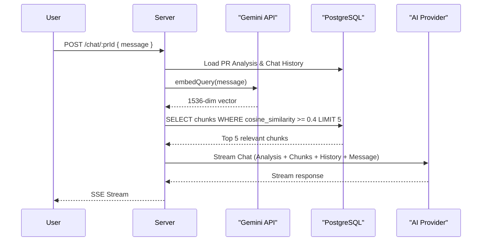

# AI & RAG Architecture

### 1. AI Provider Architecture

PRLens uses a **multi-provider round-robin** system with automatic failover and a Gemini fallback, rather than a single API integration. The OpenAI SDK (`openai` npm package) is used as the unified client interface.

### Configured Providers

| # | Name | Default Model | Notes |
|---|------|---------------|-------|
| 1 | **OpenRouter** | *(configurable)* | Primary round-robin provider |
| 2 | **Modal AI** | *(configurable)* | Round-robin participant |
| 3 | **NVIDIA** | *(configurable)* | Round-robin participant |
| 4 | **Gemini** | *(configurable)* | Round-robin participant |
| 5 | **Gemini (fallback)** | *(last provider)* | Auto-used when all round-robin providers fail |

### API Key Environment Variables

| Variable | Purpose |
|----------|---------|
| `AI_API_KEY` / `PROVIDER_1_API_KEY` | OpenRouter primary key |
| `MODAL_AI_API_KEY` | Modal AI API key |
| `NVIDIA_AI_API_KEY` | NVIDIA API key |
| `PROVIDER_GEMINI_API_KEY` | Shared Gemini API key (also used for embeddings) |

### Failover Behavior

1. Round-robin tries each configured provider in turn
2. Each provider is retried **3 times** with exponential backoff on 429/5xx
3. After all round-robin providers fail, **Gemini fallback** takes over
4. If Gemini also fails, the API returns a structured error

### Relevant Source Files

- `Backend/src/services/ai.providers.js` — provider registry, round-robin logic, Gemini chat/stream adapters
- `Backend/src/services/ai.service.js` — PR analysis (`analyzePR`, `analyzePRChunks`) and streaming chat (`streamChat`)
- `Backend/src/services/gemini-embeddings.service.js` — Gemini-only embedding client (used by RAG)


### 2. PR Analysis Flow



### AI Providers (Round-Robin + Failover)

```
Provider 1: OpenRouter
Provider 2: Modal AI
Provider 3: NVIDIA
Provider 4: Gemini
Fallback:   Gemini (last-resort, provider 5)
```

Each request picks the next provider via round-robin counter. On failure, the next provider is tried. After all primary providers fail, **Gemini** is used as fallback.

### PR Controller Responsibilities

| Step | File | Purpose |
|------|------|---------|
| Parse URL | `github.service.js` | Extract owner, repo, PR number |
| Fetch PR | `github.service.js` | Get PR details + file diffs via Octokit |
| Cache check | `cache.service.js` | Check if PR already analyzed (same head SHA) |
| Chunking | `chunker.service.js` | Filter generated files, cap to 20 files, truncate patches |
| AI call | `ai.service.js` | Send formatted prompt to round-robin providers |
| Store | `cache.service.js` | Upsert PR + analysis rows in PostgreSQL |
| RAG | `rag.service.js` | Chunk + embed + index PR diffs for chat |


### 3. RAG Embedding Pipeline

PRLens uses a Retrieval-Augmented Generation (RAG) pipeline to power contextual AI chat over pull request diffs.

### Embedding Model

| Config | Value |
|--------|-------|
| Model | `gemini-embedding-001` |
| Dimensions | `1536` |
| Index type | HNSW (cosine similarity) |

### Why 1536 Dimensions?

pgvector's HNSW and IVFFlat indexes have a hard limit of **2000 dimensions**. The previous NVIDIA embedding model (`llama-nemotron-embed-vl-1b-v2`) produced **2048-dimensional** vectors, which **cannot be indexed** by pgvector. This caused:

- Full table scans on every similarity query
- Exponential slowdowns as PR data grows
- Inability to scale past small test datasets

`gemini-embedding-001` at 1536 dimensions resolves this while keeping the system scalable.

### HNSW Indexing Strategy

```sql
CREATE INDEX IF NOT EXISTS idx_pr_chunks_embedding
ON pr_embeddings USING hnsw (embedding vector_cosine_ops);
```

- **HNSW** (Hierarchical Navigable Small Worlds) is the recommended index for high-dimensional vector search in pgvector.
- **Cosine distance** (`vector_cosine_ops`) is used because embedding quality is relative — we care about semantic similarity, not vector magnitude.
- On app startup, `connectDB()` automatically ensures the index exists.

### Re-indexing Process

When you first deploy this migration with existing 2048-dim data, the `connectDB()` migration will:

1. Drop the old index (if present)
2. Delete all existing embeddings from `pr_embeddings`
3. Alter `pr_embeddings.embedding` to `vector(1536) NOT NULL`
4. Re-create the HNSW index

After this, **re-analyze any previously indexed PRs** to populate fresh 1536-dim embeddings. The PR controller's `cleanupPRVectors` + `processAndStorePRFiles` calls handle this automatically on re-analysis.

### Validation Checklist

- [ ] `\d pr_embeddings` shows `embedding vector(1536) NOT NULL`
- [ ] `\di idx_pr_chunks_embedding` exists with method `hnsw`
- [ ] Analyzed a PR and confirmed exactly 1536-dim embeddings stored
- [ ] `SELECT COUNT(*) FROM pr_embeddings` returns non-zero after re-analysis
- [ ] `/api/chat/:prId` returns context from vector search


#### Embedding Flow Diagram



### 4. RAG Retrieval Flow (Chat Time)

### Token Budget

| Context | Cap |
|---------|-----|
| System prompt + PR analysis | 32,000 tokens |
| RAG retrieved chunks | 25,600 tokens |
| Chat history | 64,00 tokens |
| User message | 6,400 tokens |


#### Retrieval Flow Diagram

